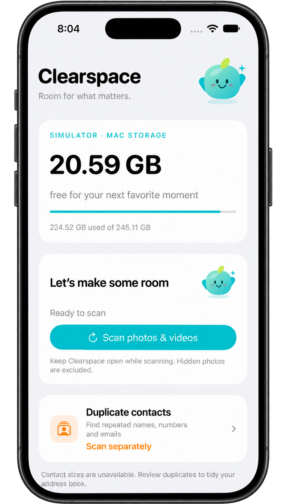
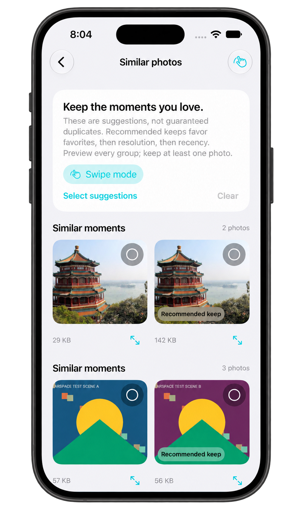
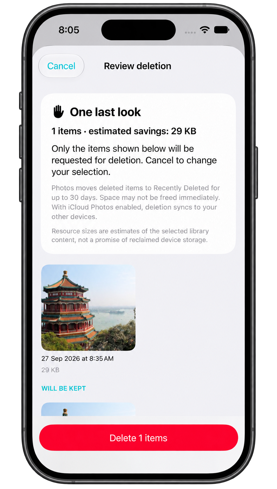
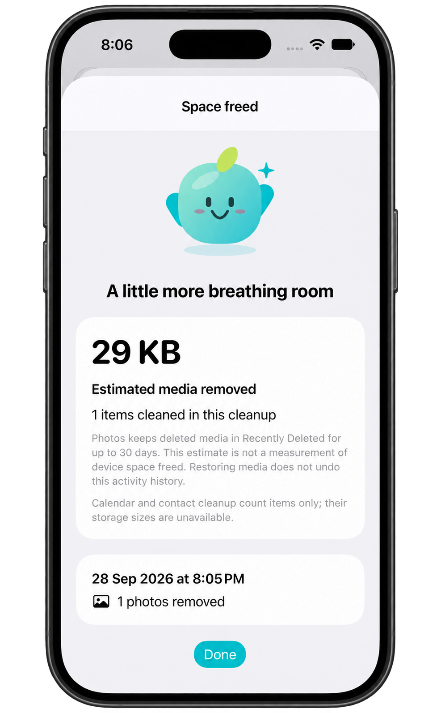

  

# Clearspace

A privacy-focused iPhone storage cleaner built with SwiftUI. Find clutter, review what to keep, and approve every deletion. Pip, the app's mascot, accompanies scanning and cleanup.

Built by **Anshuman Nitnaware** for the AppFactory Storage Cleaner assignment. All features are free, with no login, subscriptions, or advertising.
## Screenshots

  
  
  
  

## Features

| Feature | What it does |
| --- | --- |
| Storage dashboard | Shows used/free device storage and estimated cleanup sizes without counting overlapping media twice. |
| Similar photos | Groups matching previews and nearby similar shots; recommends a photo to keep. |
| Screenshots and large videos | Supports multi-selection, photo/video previews, and videos sorted by known size. |
| Duplicate contacts | Finds shared names, numbers, or emails; deletes reviewed cards while keeping at least one per group. |
| Swipe review | Swipe to keep or queue a photo for deletion, with Undo and a final review. |
| Blurry photos | Suggests potentially blurry images for manual inspection. |
| Calendar cleanup | Reviews eligible old, writable, non-recurring events from the past year. |
| Storage widget | Small and medium Home Screen widgets show device storage. |
| Cleanup summary | Records completed cleanup counts and estimated media bytes locally. |

## Run locally

1. Open `Clearspace.xcodeproj` in **Xcode 16 or newer**, using an SDK compatible with your chosen device.
2. Select the **Clearspace** scheme and an **iPhone running iOS 17 or later**.
3. For a real device, set your signing team on both **Clearspace** and **ClearspaceWidgetExtension**. If you change bundle identifiers, keep the extension identifier prefixed by the app identifier.
4. Run the app and choose Photos, Contacts, or Calendar access when you use each feature. For simulator testing, drag disposable photos and videos into the simulator first.

There are no third-party package dependencies or project-generation steps. To add the widget, run the app once, then open the Home Screen widget gallery and search for **Clearspace**.

## Privacy and safe cleanup

Analysis runs on the device; the app does not upload photos, contacts, or calendar contents. Cloud-only media is not downloaded. Photos and Contacts support limited access where available; Calendar cleanup requires full event access.

Selections and swipes never delete anything. Final reviews show what will be removed; media deletion also goes through the system Photos confirmation. Photos may retain items in Recently Deleted, and changes can sync through your existing system accounts. Displayed bytes estimate library content, not immediate device space recovered.

## Screenshots

Fresh screenshots of the current build are pending. The planned gallery covers the dashboard, similar-photo review, deletion review, and cleanup summary. See the [screenshot guide](docs/SCREENSHOTS.md) for the requested views.

## Scope and limitations

Matching and blur detection provide suggestions, not guarantees. Hidden media is excluded; unavailable items and unknown sizes are disclosed. Contacts can be deleted but **are not merged**. Video compression and the private vault are not implemented. No TestFlight link is included.

Source checks are separate from a successful Xcode build or real-iPhone test. Follow the [testing guide](docs/TESTING.md) before submitting a device recording.

## Documentation

- [Architecture and cleanup flow](docs/ARCHITECTURE.md)
- [Design decisions and limitations](docs/DECISIONS.md)
- [Assignment coverage](docs/FEATURES.md)
- [Build and acceptance tests](docs/TESTING.md)
- [Review and validation record](docs/VALIDATION.md)
