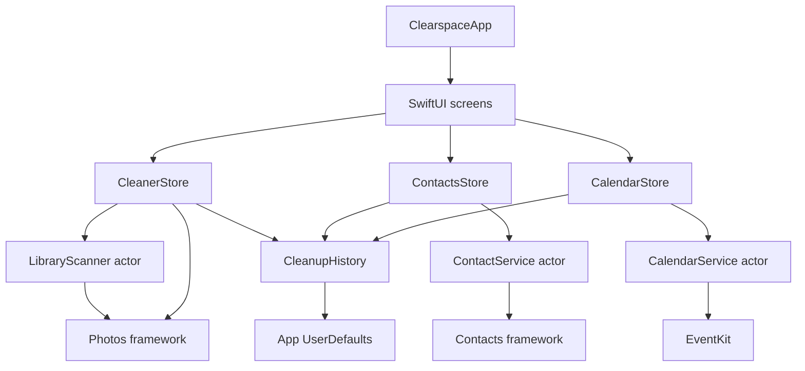
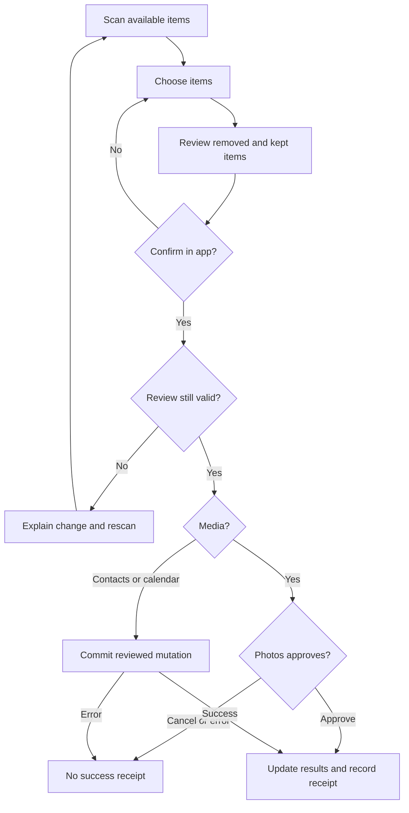

# Architecture

Clearspace is a native SwiftUI iPhone app with three independent cleanup domains and a WidgetKit extension. There is no backend or third-party runtime dependency.

## Responsibilities

| Layer | Files | Responsibility |
| --- | --- | --- |
| App state | `Clearspace/App/` | Main-actor observable stores own permission state, progress, results, and review revisions. |
| Rules and models | `Clearspace/Core/Models/` | Immutable item snapshots, matching/selection rules, byte summaries, and cleanup receipts. |
| System services | `Clearspace/Core/Services/` | Actors perform scanning and authorized mutations through Photos, Contacts, and EventKit. |
| Screens | `Clearspace/Features/` | Dashboard, category selection, previews, reviews, and completion states. |
| Design system | `Clearspace/DesignSystem/` | Shared surfaces, media previews, and Pip's motion-aware SwiftUI drawing. |
| Widget | `ClearspaceWidget/` | Reads device capacity independently; no photo library or App Group is needed. |
| Tests | `ClearspaceTests/` | XCTest coverage for rules, reconciliation, image analysis, request completion, and history. |

`ClearspaceApp` owns `CleanerStore` and `ContactsStore`. `CalendarCleanupView` owns its `CalendarStore`. Receipts are shared through `CleanupHistory` and persisted in the app's UserDefaults; media, contact details, and event contents are not written to an app database.

## Media pipeline

1. Fetch accessible, non-hidden photos in creation-date order.
2. Request a local preview; normalize its orientation for matching.
3. Hash normalized preview pixels. For near matches, compare aspect ratio, difference hash, and Vision revision 2 feature-print distance against up to 24 recent group anchors within 60 seconds. Screenshots use matching previews only.
4. Assess non-screenshot previews with a luminance Laplacian and regional sharpness checks. Blank, low-detail, or tiny images can be unassessable.
5. Stream resource bytes serially for photo cleanup candidates and all videos. Do not retain resource payloads or enable downloads. Cache successful sizes in memory against item metadata.
6. Publish groups, screenshots, blur candidates, videos, and limitation counts. Rank recommended keeps by favorite status, resolution, then recency; sort known video sizes descending, with unknown sizes last.

`RequestGate` resolves each asynchronous PhotoKit request once, including cancellation, timeout, and callbacks arriving after completion. Scan generations prevent cancelled or invalidated work from publishing old results. Media and contact scans are cancelled when the app enters the background.

## Review and mutation

Media drafts carry an epoch and snapshots of selected items plus retained members of affected groups. Before requesting deletion, the store checks access, known IDs, keep-one rules, survivor existence, metadata, and deletion capability. Confirmed removals update existing scan results and clear old selections. Unrelated library changes invalidate the scan. PhotoKit's final system prompt introduces a race that the app cannot eliminate by locking the library.

Contacts are fetched as individual records with `unifyResults = false`. Indexed matching keys form connected groups. A draft must leave at least one card in each group; the service re-fetches selected and kept cards before a single `CNSaveRequest`. Notes are not fetched because they require a separate entitlement. Whole-card deletion can remove fields not displayed in review; details are not merged.

Calendar drafts carry a revision and event snapshots. Before staging removal, the service rechecks all selected events and their eligibility. Recurring events, detached occurrences, invitations, and read-only calendars are excluded. Staged removals use one commit; errors reset staged work and invalidate the view's results.

## Widget and project

The widget bundle registers only `ClearspaceStorageWidget`. Its minimum deployment target is iOS 17, matching the app. The provider requests a refresh after 30 minutes; the system controls the actual schedule. The app also requests widget reloads when it refreshes storage.

The checked-in Xcode project is authoritative. Most app files use explicit groups and target membership; Calendar and widget folders use synchronized groups. Add files through Xcode and verify target membership. The app target embeds and depends on the widget extension.
